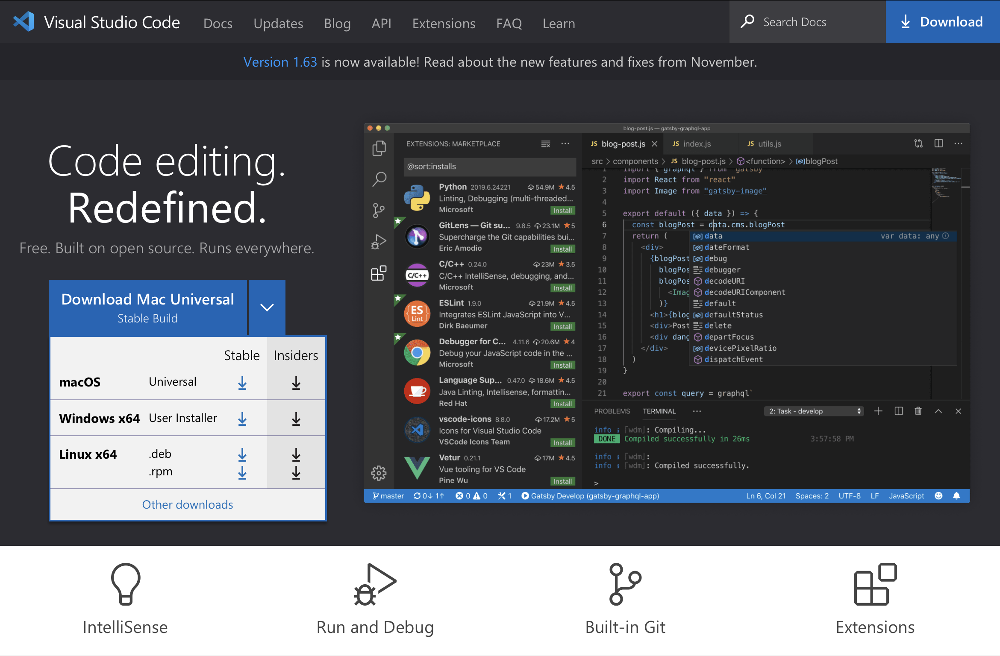
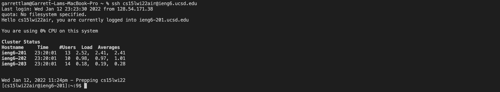
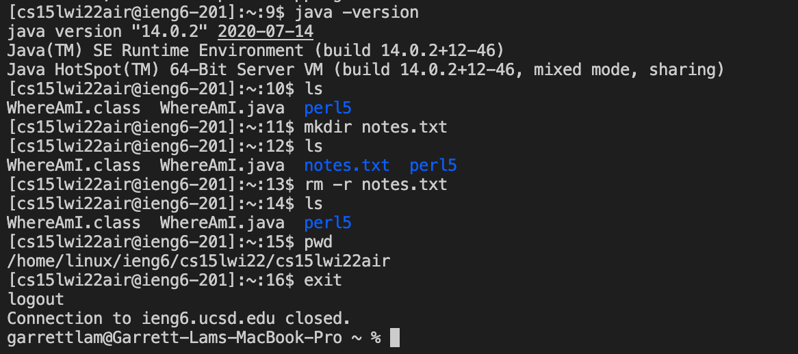
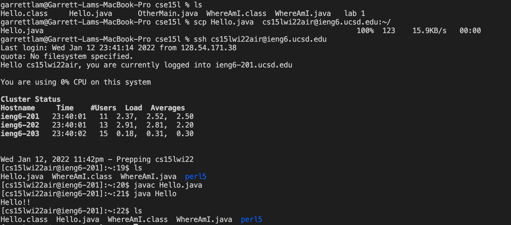
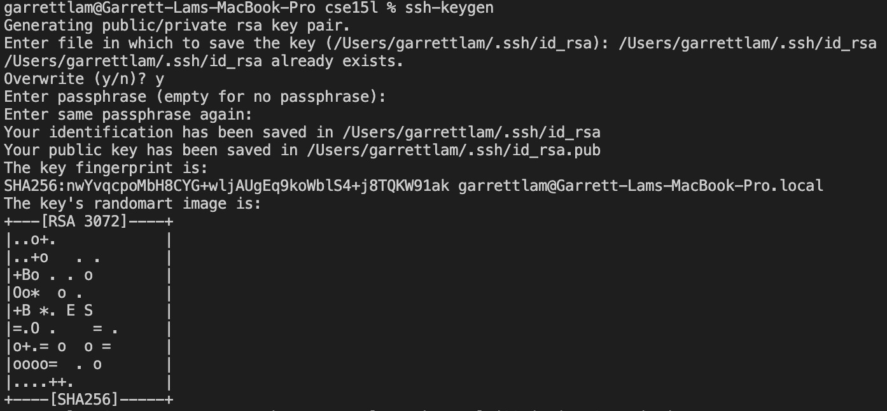
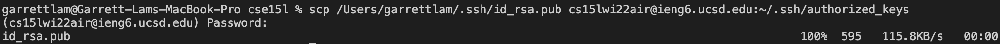
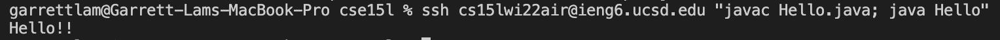

# Lab Report 1

## Installing VS Code

* Visit the [Visual Studio Code Website](https://code.visualstudio.com/) to download and install it onto your computer. 
* Pick the one that matches your operating system (OS). In my case, I downloaded the macOS Universal Stable Build option.
* If you were on Windows or Linux, you would downlow the other options.

## Remotely Connecting
VS Code allows you to use the internet to connect to a remote computer
* First you must use [Account Lookup](https://sdacs.ucsd.edu/~icc/index.php) to look for your CSE15L specific account (use your UCSD login credentials)

* Open up the terminal in VS Code via Terminal --> New Terminal in the menu
* To remotely connect to to the server enter: `ssh cse15lwi22air@ieng6.ucsd.edu` (use your CSE15L specific account)
* Since I already set up a SSH key, it directly connected me to the server without entering anything else. 

### However:
---
Normally when you login for the first time it will prompt you with this message:
> Are you sure you want to continue connecting (yes/no/[fingerprint])?
* Enter **yes**

Followed by:
> Password:
* Enter your **personal UCSD password** (nothing will show up as you type which is OK)

This process is tedious and takes a lot of time since you need to enter your password every single time you enter, later we will set up a SSH key to make this process more efficient.

---

## Trying Some Commands
While logged onto the UCSD ieng6 server, you can run terminal line commands like you would be able to on your computer's terminal.

Below are some commands I ran on the ieng6 server:

* **java -version**: prints current version of Java onto the screen
* **ls**: lists files/directories in current directory (*blue* indicates it is a directory)
* **mkdir notes.txt**: creates a directory called "notes.txt"
* **rm -r notes.txt**: removes the "notes.txt" directory in the current directory
* **pwd**: prints the working directory to the screen

## Moving files with scp
The `scp` command allows you to copy files from your local computer to the remote comptuer:
* By doing `ls` in a cse15l directory on my local computer, there are files as shown

Let's say I want to copy `Hello.java` onto the remote computer
* **On your local computer**, enter: `scp Hello.java cse15lwi22air@ieng6.ucsd.edu:~/`
* Now logging on to the remote computer, entering `ls` shows that `Hello.java` is listed.

Similarly how you can compile and run Java files on your local computer, you can also do that on the remote computer:
* Enter `javac Hello.java` followed by `java Hello`, this will also create a new file `Hello.class`

## Setting an SSH Key
As mentioned earlier, using `ssh` to log on to the ieng6 server and entering your password each time takes a long time. Setting up an SSH key will streamline this process.

* On your **local computer**, enter `ssh-keygen` followed by `/Users/garrettlam/.ssh/id_rsa` (replace garrettlam with your username)
* Since I already have a SSH key, I will have to overwrite it by entering `y`.
* Enter a passphrase, or just leave it empty by pressing Enter on your keyboard again then confirm it.

This does the following on your local computer:
1. Creates a private key in `/Users/garrettlam/.ssh/id_rsa`
2. Creates a public key in `/Users/garrettlam/.ssh/id_rsa.pub`

* Finally to finish off setting up the SSH key, on your local computer, enter: `scp /Users/garrettlam/.ssh/id_rsa.pub cs15lwi22air@ieng6.ucsd.edu:~/.ssh/authorized_keys`
* Enter your password, then you are all set up

Now you will be able to use the `ssh` or `scp` commands from your local computer to the remote computer without entering a password.

## Optimizing Remote Running

**Scenario**: You made some edits on your local computer to the file `Hello.java` and need to copy and run it on the remote server.
* By entering `ssh cse15lwi22air@ieng6.ucsd.edu "javac Hello.java; java Hello"`, you are able to do this

Key takeaways from this command:
* After typing `ssh cse15lwi22air@ieng6.ucsd.edu`, whatever you type in the `" "` is what will be run on
* Semicolons (`;`) can be used to separate and run multiple commands on the same command line

>*tip:* Using the up arrow on your keyboard in the terminal allows you go through previous commands you entered to edit or re-enter them.