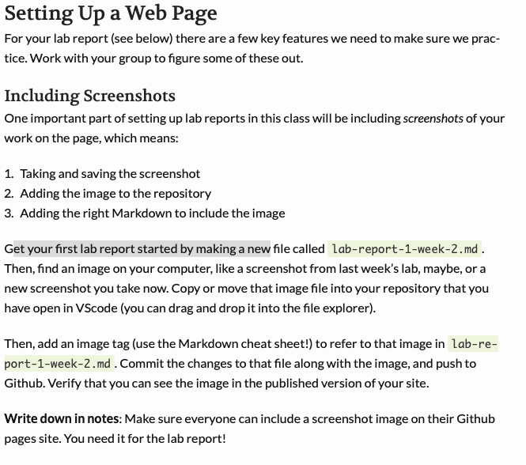

# Lab Report 1

## Installing VS Code

* Visit the [Visual Studio Code Website](https://code.visualstudio.com/) to download and install it onto your computer. Pick the one that matches your operating system (OS). In my case, I downloaded the macOS Universal Stable Build option.

## Remotely Connecting

