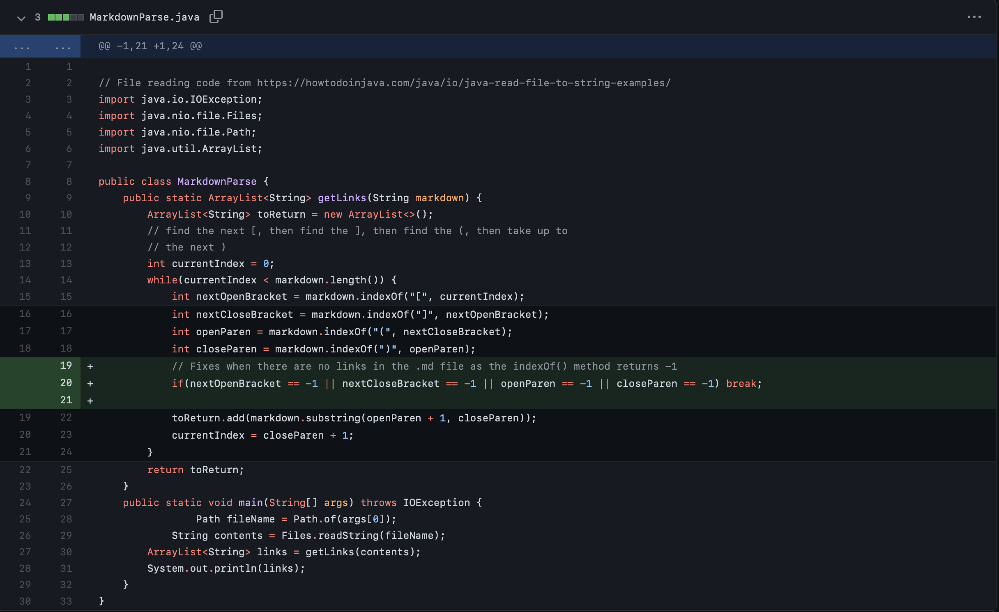
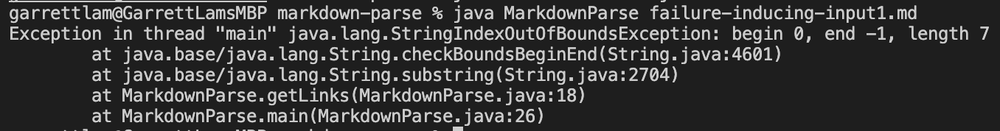
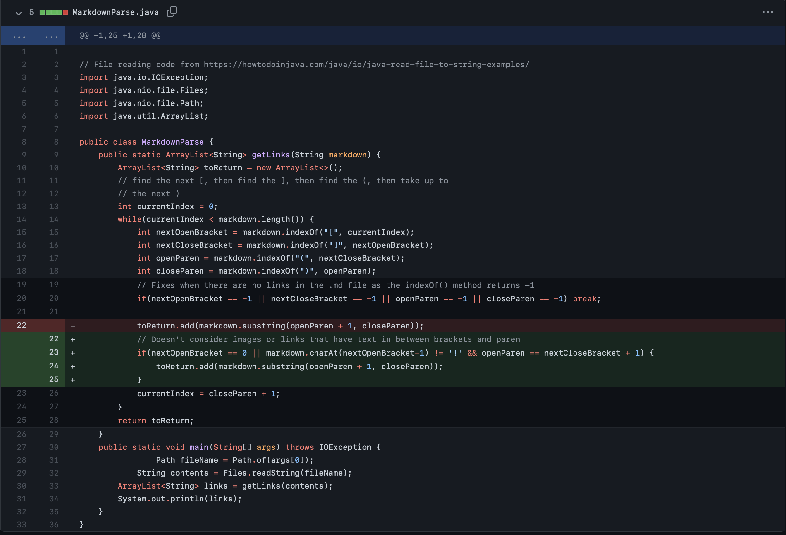
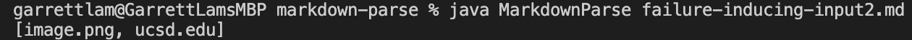
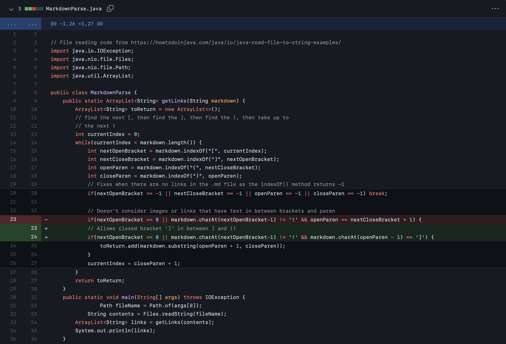
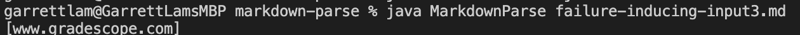

# Lab Report 2

## **Code Change 1**: Fix when no bracket or parenthesis in file
The reason for adding this line of code is because of this: [Failure Inducing Input 1](https://github.com/garrett-lam/markdown-parse/commit/30dd4293655185b8c192a5d6a092b6849e9aa693)

Running the code `javac MarkdownParse.java` followed by `java MarkdownParse failure-inducing-input1.md` outputs this:

* I added this line of code because the `indexOf()` method returns -1 if the argument, in this case `[` or `]` or `(`or `)` is not found in the markdown file
* This line of code allows for breaking out of the while loop which avoids the StringIndexOutOfBoundException
* The output after the code is added is `[]`

Input 1 exposed:
* A *bug* in the program where the program does not take into account when `[` or `]` or `(`or `)` is not found in markdown file
* A *symptom* of this bug is the program crashing dueStringOutOfBoundException as the add() method for ArrayLists cannot index into -1. 

---

## **Code Change 2**: Fix copying image files and allows text in between brackets and parenthesis
The reason for coding this if statement is because of this: [Failure Inducing Input 2](https://github.com/garrett-lam/markdown-parse/commit/993ca3cffa6ad9b1c22fc1bf26b953107ab9489b)

Running the updated code `javac MarkdownParse.java` followed by `java MarkdownParse failure-inducing-input2.md` outputs this:

* I added this line of code as it will prevent the code from adding the image file into the output. 
* This is because in markdown files, images must start with an exclamation mark '!' next to the first open brackets
* Moreover, by adding `openParen == nextCloseBracket + 1` into the code, it allows for links that have text to be in between the close brackets and open parenthesis to be outputted.
* The output after the code the if statement is `[ucsd.edu]`

Input 2 exposed:
* A *bug* in the program where it reads image files as links in the program and does not allow text in between closed bracket and open parnethesis
* A *symptom* of this bug is the program printing the image file to outputm in this case `image.png`

---
## Code Change 3: Fix having extra ']' in between brackets and parenthesis to be outputted
The reason for changing the if statement in code is because of this: [Failure Inducing Input 3](https://github.com/garrett-lam/markdown-parse/commit/11b398ff8a13acb73ec1f948a5397c29691dc534)

Running the updated code `javac MarkdownParse.java` followed by `java MarkdownParse failure-inducing-input3.md` outputs this:

* I added this line of code as it allows for links that have a ']' just before the open parenthesis to be outputted.
* Originally only `[gradescope.com]` would show up in the output
* After debugging the if statement, the output is `[www.gradescope.com, www.canvas.com]`

Input 3 exposed:
* A *bug* in the program where it did not include links from the markdown file that had extra closed brackets between the first closed bracket and open parenthesis
* A *symptom* of this bug is the program not printing the valid link to output, in this case `www.canvas.com`

