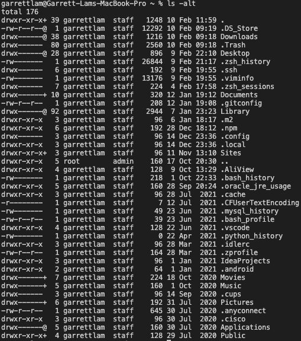
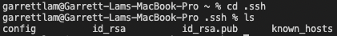
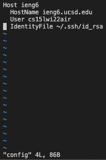
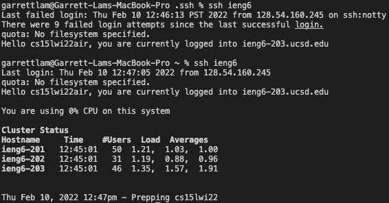
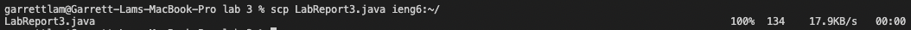
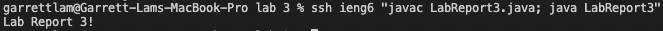

# Lab Report 3

## Choice 1: Streamlining ssh Configuration
---
### Show your `.ssh/config` file, and how you edited it (with VScode, another program, etc)

* First to find the `.ssh/config` file, I used entered `ls -alt` in my home directory.
* This lists all the files/directories in my current directory (including hidden files) sorted by last modified. (Most recently modified at the top)

* Afterwards I entered `cd .ssh` to enter the .ssh directory and `ls` to show files/directories within the .ssh directory
* As shown the config file is present

* I used Vim to edit the config file, entering `vim config` allows me to open the config file
* To edit the file, I typed `i` to enter INSERT MODE then edited as required then `esc` on the keyboard to go back to NORMAL MODE
* To save and exit, I entered `:wq` to where the `w` means save and `q` means exit

### Show the `ssh` command logging you into your account using just the alias you chose.
* Now just by entering `ssh ieng6` into the terminal, I am able to log onto my cs15wi22 ieng6 account.

### Show an `scp` command copying a file to your account using just the alias you chose.
* On my local computer, I have a directory caleld lab 3 with a file called LabReport3.java 
* By streamlining ssh configuration, I am now able to copy a file from my local computer to the ieng6 account just by using the alias (ieng6) by entering `scp LabReport3.java ieng6:~/`

* Similarly to what I did in lab report 1, you can compile and run the java files from your local computer
* To connect to the ieng6 account and to compile and run LabReport3.java I entered: `ssh ieng6 "javac LabReport3.java; java LabReport3"`

