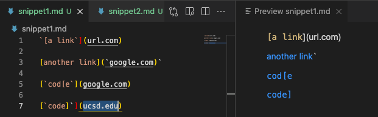
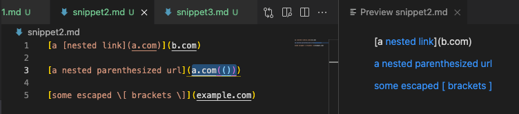
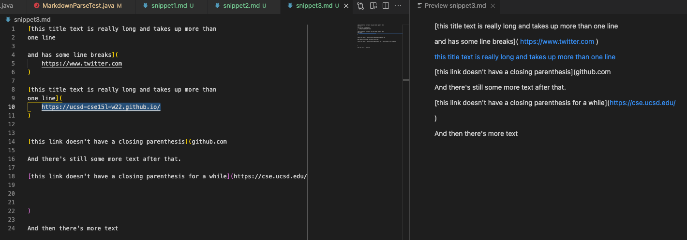
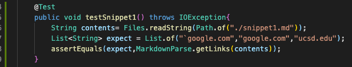
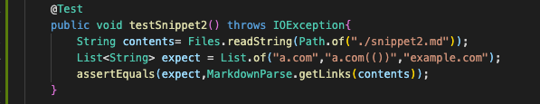
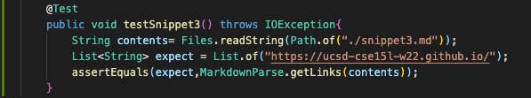
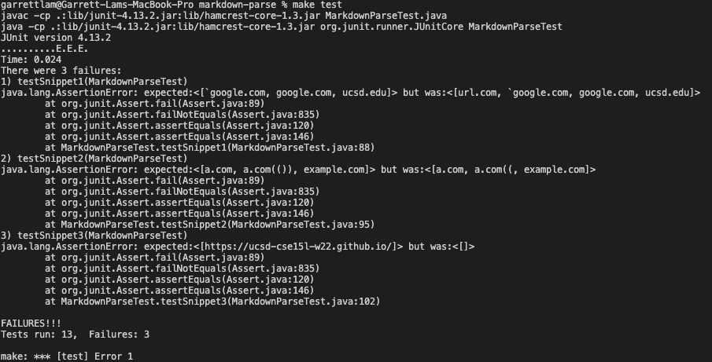
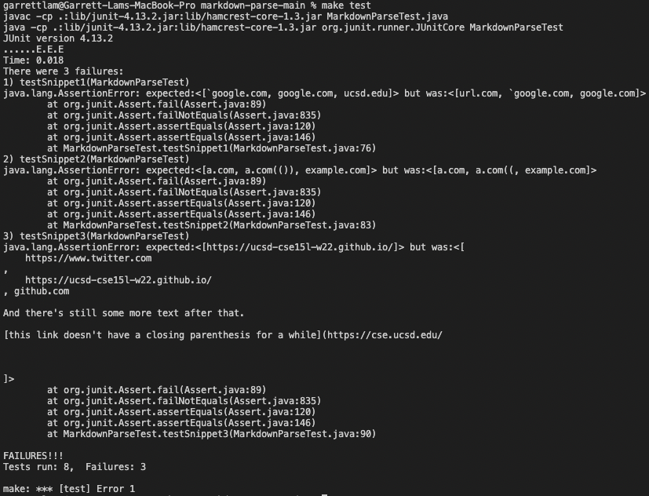

# Lab Report 4

Link to [my markdown-parse repository](https://github.com/garrett-lam/markdown-parse)

Link to [group I reviewed repository](https://github.com/JessalynWang/markdown-parse)

### According to VS Code preview,

There are 3 valid links in Snippet 1: **`google.com**, **google.com**, and **ucsd.edu**.

There are 3 valid links in Snippet 2: **a.com**, **a.com(())**, and **example.com**.

There is 1 valid links in Snippet 3: **https://ucsd-cse15l-w22.github.io/**

Based on VS Code preview, I created these tests to run in my own markdown-parse repository and in the other group's markdown-parse repository I reviewed. (6 Test Methods were created)

* I used `contents` to store the contents of the each snippet's markdown file by calling the `readString` method
* `expect` was used to store the expected output if `MarkdownParse.java` worked properly. In other words, the valid links based on VS Code preview
* JUnit's `assertEquals` method allows me to compare check if `expect` equals to `contents`.

## JUnit test output from my markdownparse implementation

* From the output, my implementation of markdownparse failed all three test cases 

## JUnit test output for other group's markdownparse implementation

* From the output, the other group's implementation of markdownparse also failed all three test cases 

## Follow Up Code Change Questions
* For snippet 1, I do not believe there is a small code change that I would be able to make to my program for it to work for all backtick related cases. 
