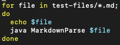
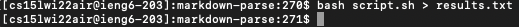
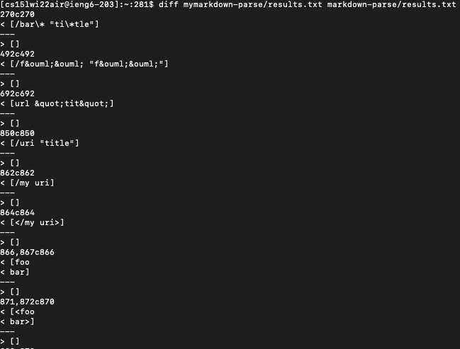
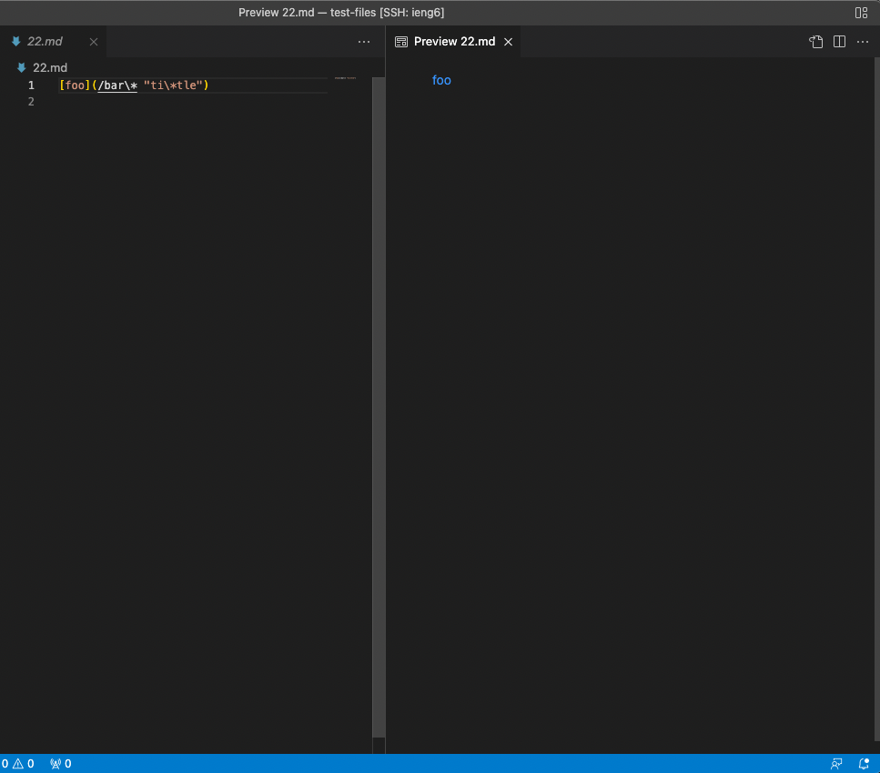
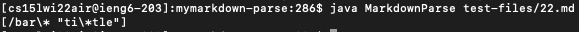
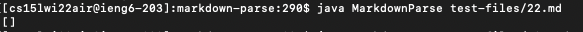
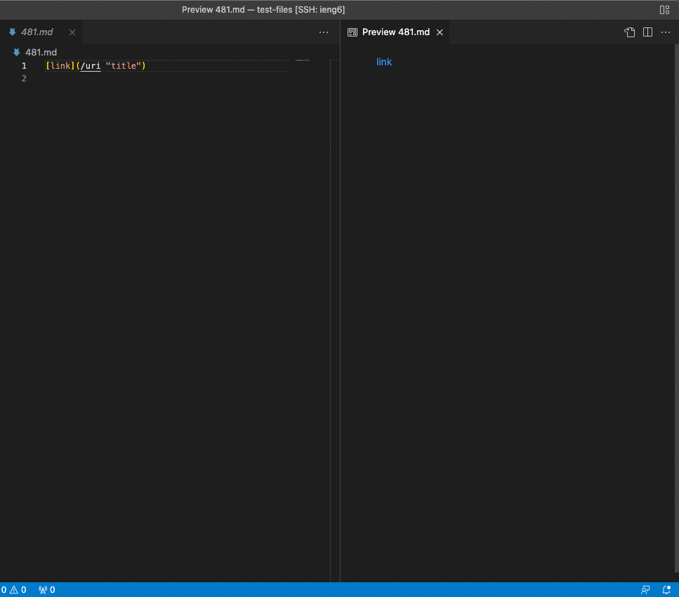
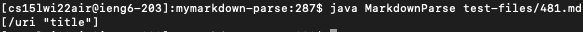
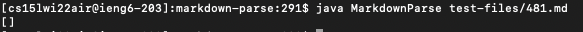
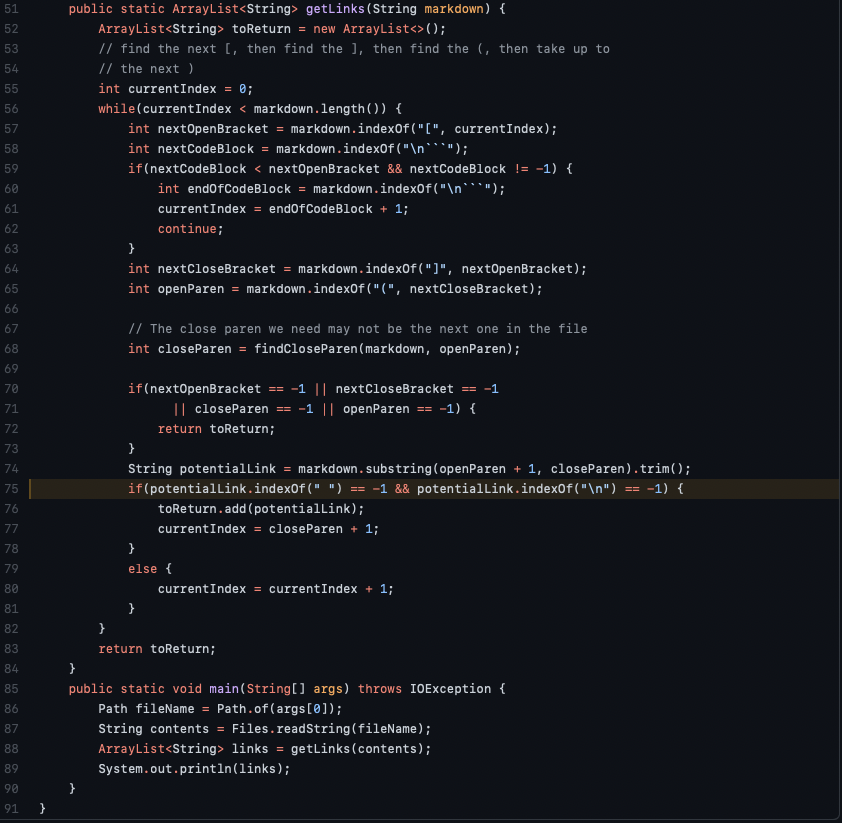

# Lab Report 5

I ran the 652 commonmark-spec tests in the test-files directory using the lab 9 markdown-parse repository given and my own markdown-parse repository. I did this by creating a `script.sh` file in both repositories running `java MarkdownParse` on each file using a for loop.

* The `*.md` means all md fails in test-files
* `echo $file` was to print out the name of the file

Following this, in **both** repositories, I used the bash command on script.sh by typing `bash script.sh`. Instead of printing it to the console, I used output redirection to put the command's output into a file. I did this by entering `> results.txt` next to the `bash script.sh` command.

* This resulted in a new file in each repository being called `results.txt` which contains the output of running the `bash script.sh` command.

## Comparing my markdown-parse vs lab 9 markdown-parse's implementation
With two `results.txt` files, one in each repository, I compared the outputs of running MarkdownParse in each repository using `diff` on the results of running the bash for loop. I entered `diff mymarkdown-parse/results.txt markdown-parse/results.txt` in the home directory of my ieng6 account.

* `diff` takes two files as arguments, in this case, `mymarkdown-parse/results.txt` and `markdown-parse/results.txt`
* This outputs the differences between the files to the terminal as shown above
* *note:* there is a lot more output differences, this screenshot is only a small amount.

---
### How to read `diff` output
* The first line means which line in the `results.txt` file
* The second line is the output from the first argument, i.e. `mymarkdown-parse/results.txt`
* The third line is just a separater
* The fourth line is the output from the second arugment, i.e. `markdown-parse/results.txt`

**For this lab report, I chose to compare output differences indicated at `270c270` and `850c850`**

---

### Test 1: 22.md
Line 270 corresponds to the output of test 22.md

* According to VS Code preview, foo is a valid hyperlink containing the link **/bar\* “ti\Itle”**. 
* Therefore, expected output should be: [/bar\* “ti\Itle”]

My markdown-parse produced this output:

Lab 9's markdown-parse produced this output:

* From the outputs, my markdown-parse produced the correct output while the lab 9's markdown-parse produced the incorrect output.

### Test 2: 481.md
Line 850 corresponds to the output of test 481.md

* According to VS Code preview, link is a valid hyperlink containing the link **/uri “title”**. 
* Therefore, expected output should be: [/uri “title”]

My markdown-parse produced this output:

Lab 9's markdown-parse produced this output:

* From the outputs, my markdown-parse produced the correct output while the lab 9's markdown-parse produced the incorrect output.

### Problem with Lab 9's markdown-parse for 22.md and 481.md
For both of the tests, the **bug** with lab 9's markdown-parse implementation is that it doesn't allow links that have spaces to be outputted (i.e. count as links).

On line 75-76, lab 9's code only allowed `potentialLink` to be added to `toReturn` when `potentialLink.indexOf(" ") == -1` && `potentialLink.indexOf("\m") == -1`.
* This means that potentialLink cannot be added if there are any spaces or new lines present.
* Therefore, this lead to the potential links in 22.md and 481.md to not be added to `toReturn` since both of them have a space(" ") in the md file, which lead to [] being the output.

The code that should be **fixed** should be line 75:
* You should remove `potentialLink.indexOf(" ") == -1` from the if statement.

This should fix the program and allow test outputs for 22.md and 481.md to be correct.
